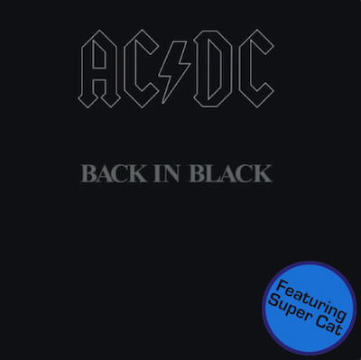

# (Feat. Super Cat)

Have any song feature Super Cat, the Jamaican dance hall DJ best known for his appearance on Sugar Ray's "Fly."

[](https://github.com/waldoj/featuring-super-cat/raw/main/Back%20in%20Black.mp4)

## Requirements

* [ffmpeg](https://ffmpeg.org/) (provides `ffmpeg` and `ffprobe`)
* `sips`, for resizing cover art — included with macOS

## Usage

Point the script at a song, and it writes an MP4 alongside it:

```sh
./supercat.sh "your_song.mp3"
```

For a song at `songs/01 Layla.m4a`, that produces
`songs/01 Layla (Feat. Super Cat).mp4`.

Any audio format ffmpeg can decode works — MP3, M4A, FLAC, WAV. The source has
to have cover art embedded, since that art becomes the video.

### What the script does

1. Generates seven seconds of silence.
2. Concatenates that silence onto the front of your song, so Super Cat gets the
   intro to himself.
3. Mixes the result with `supercat.mp3`.
4. Extracts the song's embedded cover art and squares it off at 750×750.
5. Stamps `overlay.png` into the bottom right corner, as a sticker.
6. Renders a 30-second MP4 pairing that still image with the mixed audio,
   fading out over the last two seconds.

Intermediate files live in `/tmp` and are cleaned up on exit.

## Why?

🤷‍♂️
